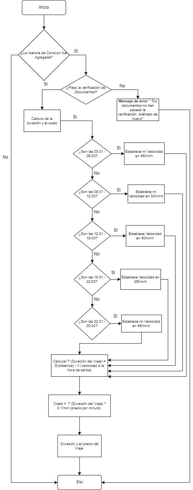

# 🚘 Urban Routes: Diseño de Pruebas y Análisis de Requerimientos (Car Sharing)

   

## 📌 Resumen del Proyecto (Metodología STAR)

*   **Situación:** La aplicación **Urban Routes** requería lanzar una nueva funcionalidad de "Compartir un Automóvil" (Car Sharing) . Era crítico asegurar que el formulario de "Agregar licencia de conducir" validara correctamente los datos del usuario , y que el algoritmo dinámico de cálculo de precios y duración del viaje (basado en la hora de salida y la distancia) funcionara sin errores matemáticos [3, 8].
*   **Tarea:** Descomponer los requisitos de negocio, identificar "zonas grises" (ambigüedades) y diseñar la arquitectura de pruebas desde cero utilizando técnicas formales de diseño de pruebas.
*   **Acción:** 
    * Modelé la interfaz y el comportamiento del módulo de licencias mediante un **Mapa Mental** .
    * Diseñé un **Diagrama de Flujo** para mapear la lógica de selección de velocidad del vehículo según franjas horarias (ej. 45 km/h de 00:01 a 08:00) .
    * Apliqué técnicas de **Clases de Equivalencia y Análisis de Valores Límite** para estresar los campos de "Nombre" y "Apellido" (validando longitudes de 2 a 14 caracteres, uso de guiones y caracteres no latinos).
    * Redacté Casos de Prueba matemáticos para validar la fórmula del backend: `T (duración) = S (distancia) / V (velocidad)` y `Costo = T * precio por minuto`.
*   **Resultado:** Se entregó una matriz de pruebas robusta que garantizó una cobertura exhaustiva tanto en validaciones de UI como en la lógica del backend. La aplicación estricta de valores límite previno errores de cálculo en producción y vulnerabilidades en la entrada de datos del usuario.

---

## 🛠️ Muestra Técnica: Técnicas de Diseño de Pruebas

Para maximizar la cobertura minimizando la redundancia, utilizo el particionamiento de equivalencia. Este es un extracto de mi análisis para el campo "Nombre" del formulario de licencia de conducir:

| Nombre de la clase | Límites | Datos de prueba dentro de la clase | Datos de prueba en los límites |
| :--- | :--- | :--- | :--- |
| Longitud válida (2 a 14 caracteres) | `Rango: 2, 14` | 10 Caracteres - "Roque Ivan" | `Li: 2`, `Ls: 14`, `Li-1: 1`, `Ls+1: 15` |
| Caracteres Especiales (Inválido) | `Conjunto` | "Auxili@dor13" | N/A |
| Caracteres no Latinos (Válido) | `Conjunto` | "María" (Uso de tildes) | N/A |

---
*🧑‍💻 Perfil Técnico: María Auxiliadora Vélez Mendoza - QA Engineer*